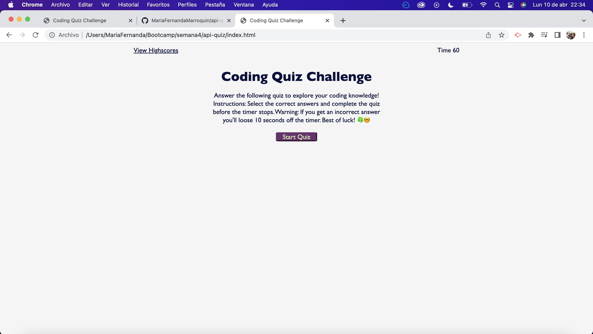
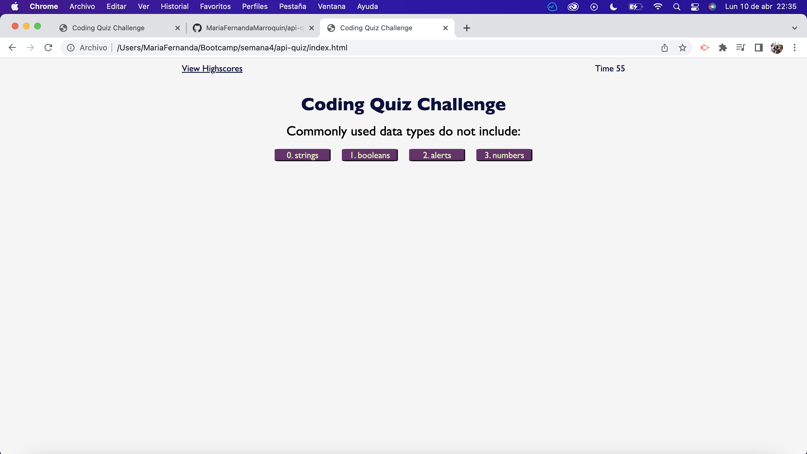
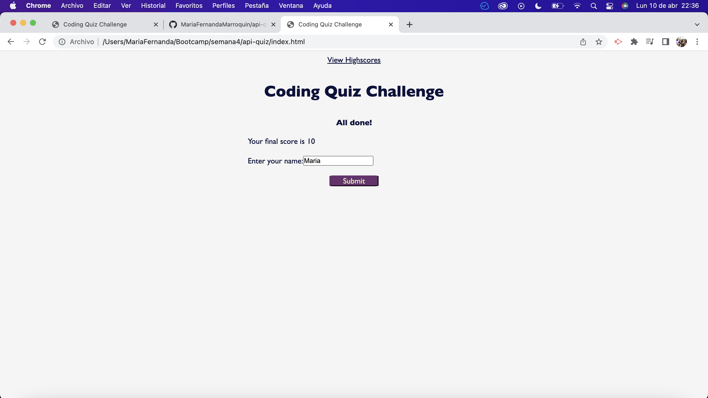
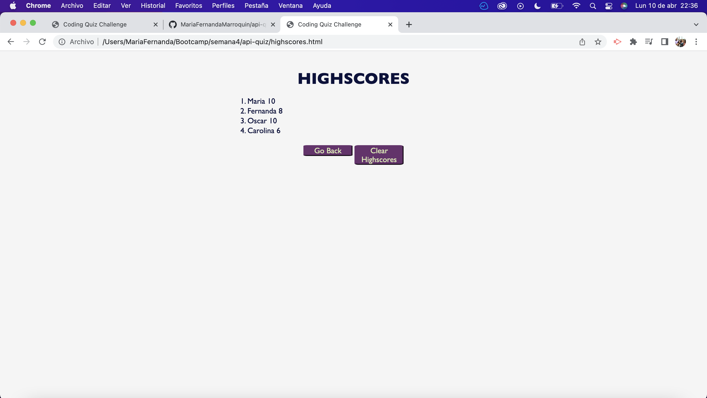

# 04 Web APIs: Code Quiz

## Task

Week 4 challenge was about creating an API's Quiz to test JavaScrip knowledge. The challenged required to create all the code from scratch: HTML, CSS and JavaScript. 


## User Story

```
AS A coding boot camp student
I WANT to take a timed quiz on JavaScript fundamentals that stores high scores
SO THAT I can gauge my progress compared to my peers
```

## Acceptance Criteria

```
GIVEN I am taking a code quiz
WHEN I click the start button
THEN a timer starts and I am presented with a question
WHEN I answer a question
THEN I am presented with another question
WHEN I answer a question incorrectly
THEN time is subtracted from the clock
WHEN all questions are answered or the timer reaches 0
THEN the game is over
WHEN the game is over
THEN I can save my initials and my score
```

## Mock-Up

The following screenshots demonstrates the application functionality:

Start Quiz Screen



Questions 



Submit User Name 



Highscores Screen




## Deployed Application

* Application user experience is intuitive and easy to navigate.

escribing the project.
---

© 2023 edX Boot Camps LLC. Confidential and Proprietary. All Rights Reserved. María Fernanda Marroquín

